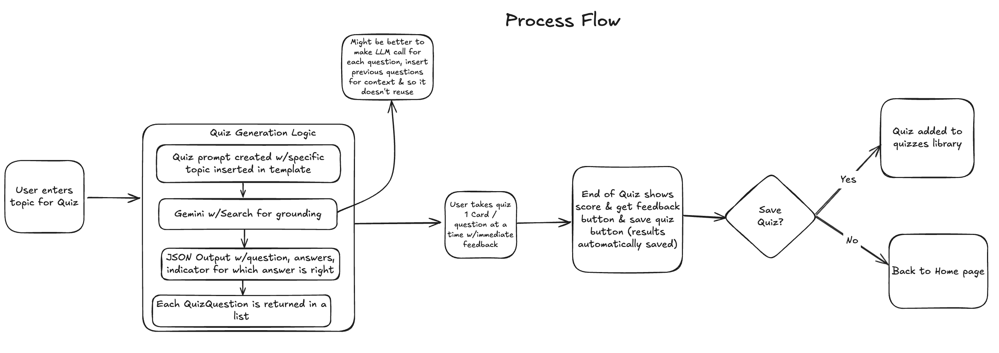
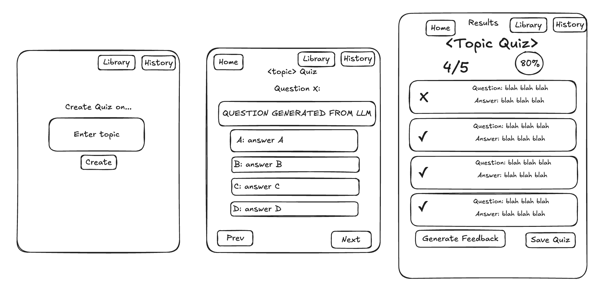

# 🧠 AI Quiz Generator

[](https://github.com/sethbeckett/quiz-generator/actions)
[](https://codecov.io/gh/sethbeckett/quiz-generator)
[](https://www.apache.org/licenses/LICENSE-2.0)
[](https://www.python.org/downloads/)
[](https://nodejs.org/)
[](https://www.docker.com/)

A modern, AI-powered web application that generates custom multiple-choice quizzes on any topic using the Google Gemini API with search for contextual grounding.

## ✨ Features

- **AI-Powered Quiz Generation**: Uses Google Gemini API with search functionality for accurate, up-to-date content
- **Interactive Quiz Taking**: Clean, modern interface for taking quizzes with progress tracking
- **Instant Results**: Detailed feedback with correct answers and explanations
- **Topic Flexibility**: Generate quizzes on virtually any topic
- **Responsive Design**: Works seamlessly on desktop and mobile devices
- **Professional Architecture**: Clean, modular codebase following best practices

## 🏗️ Architecture

### Backend (FastAPI)
- **Framework**: FastAPI with async support
- **Database**: SQLite with SQLAlchemy ORM (easily scalable to PostgreSQL)
- **AI Integration**: Google Gemini API with search grounding
- **API Documentation**: Automatic OpenAPI/Swagger docs

### Frontend (React + TypeScript)
- **Framework**: React 18 with TypeScript
- **State Management**: React hooks with proper error handling
- **Styling**: Modern CSS with responsive design
- **API Client**: Axios with interceptors for error handling

### Key Components
```
├── Backend (FastAPI)
│   ├── Quiz Generation Service (Gemini API)
│   ├── Database Models (SQLAlchemy)
│   ├── API Routes (FastAPI)
│   └── Business Logic Services
└── Frontend (React)
    ├── Quiz Generator (Topic Input)
    ├── Quiz Taker (Interactive Quiz)
    ├── Quiz Results (Scoring & Feedback)
    └── API Service Layer
```

## 🎨 Architecture & UI Overview

### Process Flow
The following diagram was the rough draft illustrating the complete user journey and system interactions:



### UI Design
Here's the rough draft for the layout of the different pages:



*Note: These are working drafts of the architecture and interface design, showcasing the planned user experience and system flow.*

## 🚀 Quick Start

### Prerequisites
- **For Docker (Recommended):** Docker Desktop installed
- **For Local Development:** Python 3.11+ and Node.js 18+
- **Required:** Google Gemini API key from [Google AI Studio](https://aistudio.google.com/)

### Option 1: Docker (Recommended)

1. **Clone the repository**
   ```bash
   git clone <repository-url>
   cd quiz-generator
   ```

2. **Set up environment variables**
   ```bash
   # Copy example environment file
   cp .env.example .env
   
   # Edit .env and add your Gemini API key from Google AI Studio
   GEMINI_API_KEY=your_api_key_here
   ```

3. **Run with Docker Compose**
   ```bash
   docker compose up --build
   ```

4. **Access the application**
   - Frontend: http://localhost:3000
   - Backend API: http://localhost:8000
   - API Documentation: http://localhost:8000/docs

### Option 2: Local Development

#### Backend Setup
```bash
cd backend

# Create virtual environment
python -m venv venv
source venv/bin/activate  # On Windows: venv\Scripts\activate

# Install dependencies
pip install -r requirements.txt

# Set environment variables
export GEMINI_API_KEY=your_api_key_here
export DATABASE_URL=sqlite:///./quiz_generator.db

# Run the server
uvicorn app.main:app --reload --host 0.0.0.0 --port 8000
```

#### Frontend Setup
```bash
cd frontend

# Install dependencies
npm install

# Set environment variables
echo "REACT_APP_API_BASE_URL=http://localhost:8000/api/v1" > .env

# Run the development server
npm start
```

## 🔧 Configuration

### Environment Variables

#### Backend (.env)
```bash
GEMINI_API_KEY=your_gemini_api_key_here
DATABASE_URL=sqlite:///./quiz_generator.db
DEBUG=True
API_HOST=localhost
API_PORT=8000
FRONTEND_URL=http://localhost:3000
SECRET_KEY=your-secret-key-here
```

#### Frontend (.env)
```bash
REACT_APP_API_BASE_URL=http://localhost:8000/api/v1
```

## 📖 Usage

1. **Generate a Quiz**
   - Enter any topic (e.g., "Photosynthesis", "Machine Learning", "Ancient Rome")
   - AI searches for current information and generates 5 multiple-choice questions
   - Each question has 4 options with only one correct answer

2. **Take the Quiz**
   - Navigate through questions using the interface
   - Track your progress with the visual progress bar
   - Review and change answers before submitting

3. **View Results**
   - See your score and percentage
   - Review correct answers with explanations
   - Start a new quiz on a different topic

## 🧪 Testing

> **Recommended:** Use Docker for running tests to ensure consistency across environments.

### Running Tests with Docker (Recommended)

#### Backend Tests

**Unit Tests (Fast, No External Dependencies)**
```bash
# Run only unit tests (recommended for development)
docker compose run --rm backend pytest tests/ -m "not integration" -v

# Run with coverage
docker compose run --rm backend pytest tests/ -m "not integration" --cov=app --cov-report=term-missing
```

**Integration Tests (Requires API Keys)**
```bash
# Run integration tests (requires GEMINI_API_KEY)
docker compose run --rm backend pytest tests/test_integration.py -v

# Run all tests (unit + integration)
docker compose run --rm backend pytest tests/ -v
```

**Code Quality & Linting**
```bash
# Run Ruff linting and formatting
docker compose run --rm backend ruff check app/ tests/
docker compose run --rm backend ruff format --check app/ tests/

# Run type checking
docker compose run --rm backend mypy app/

# Auto-fix linting issues
docker compose run --rm backend ruff check --fix app/ tests/
docker compose run --rm backend ruff format app/ tests/
```

#### Frontend Tests
```bash
# Run all frontend tests
docker compose run --rm frontend npm test -- --watchAll=false --verbose

# Run tests in interactive mode
docker compose run --rm frontend npm test

# Run tests with coverage
docker compose run --rm frontend npm test -- --coverage --watchAll=false

# Run frontend linting
docker compose run --rm frontend npm run lint
```

### Running Tests Locally (Alternative)

#### Backend Tests
```bash
cd backend
python -m venv venv
source venv/bin/activate  # On Windows: venv\Scripts\activate
pip install -r requirements.txt
pytest tests/ -v
```

#### Frontend Tests
```bash
cd frontend
npm install
npm test
```

## 🚀 CI/CD Pipeline

This project includes a comprehensive GitHub Actions CI/CD pipeline that automatically:

### 🔍 Code Quality Checks
- **Backend Linting**: Ruff (linting & formatting), mypy (types)
- **Frontend Linting**: ESLint, TypeScript type checking
- **Security Scanning**: Trivy vulnerability scanner

### 🧪 Automated Testing
- **Backend Tests**: Full test suite with pytest and coverage reporting
- **Frontend Tests**: React component tests with Jest and coverage
- **Docker Build**: Ensures containers build and start correctly

### 📊 Coverage Reporting
- Automatic coverage reports uploaded to Codecov
- Coverage badges in README show current test coverage
- Detailed coverage reports for both backend and frontend

### 🛡️ Security & Quality
- Vulnerability scanning on every push/PR
- Type checking for TypeScript and Python
- Code formatting validation
- Build verification

The pipeline runs on every push and pull request to `main` and `develop` branches.

## 🏗️ Development

### Project Structure
```
quiz-generator/
├── backend/                 # FastAPI application
│   ├── app/
│   │   ├── main.py         # Application entry point
│   │   ├── config.py       # Configuration management
│   │   ├── database.py     # Database setup
│   │   ├── models/         # SQLAlchemy models
│   │   ├── schemas/        # Pydantic schemas
│   │   ├── routers/        # API routes
│   │   ├── services/       # Business logic
│   │   └── utils/          # Utility functions
│   ├── tests/
│   └── requirements.txt
├── frontend/               # React application
│   ├── src/
│   │   ├── components/     # React components
│   │   ├── services/       # API client
│   │   ├── types/          # TypeScript types
│   │   └── App.tsx
│   └── package.json
├── docker-compose.yml
└── README.md
```

### Code Quality
- **Backend**: Black, isort, flake8, mypy
- **Frontend**: ESLint, Prettier, TypeScript strict mode
- **Testing**: Pytest (backend), Jest (frontend)

## 🔄 API Endpoints

### Quiz Management
- `POST /api/v1/quiz/generate` - Generate a new quiz
- `GET /api/v1/quiz/{quiz_id}` - Get quiz by ID
- `GET /api/v1/quiz/` - List all quizzes
- `POST /api/v1/quiz/{quiz_id}/submit` - Submit quiz answers
- `GET /api/v1/quiz/{quiz_id}/attempts` - Get quiz attempts
- `POST /api/v1/quiz/{quiz_id}/feedback` - Get explanations for incorrect answers

### Health Checks
- `GET /health` - Application health
- `GET /api/v1/health` - API health with Gemini status

## 🚀 Production Considerations

For scaling beyond this technical demo:

1. **Database**: Migrate from SQLite to PostgreSQL
2. **Environment**: Set `DEBUG=False` and proper secret keys  
3. **Security**: Add authentication, rate limiting, input sanitization
4. **Monitoring**: Implement logging, metrics, and health checks
5. **Deployment**: Use proper CI/CD with environment management

## 📝 License

This project is licensed under the Apache License 2.0 - see the [LICENSE](LICENSE) file for details.

---

**Note**: This is a technical interview demonstration project showcasing AI integration, modern web development practices, and clean architecture patterns.

## 🔮 Potential Enhancements

This technical demo could be extended with:

- User authentication and profiles
- Quiz sharing and collaboration  
- Advanced analytics and statistics
- Multiple question types (true/false, fill-in-the-blank)
- Difficulty level selection
- Quiz categories and tagging
- Export functionality

## 🐛 Troubleshooting

### Common Issues

1. **Docker Issues**
   - **"docker-compose: command not found"**: Use `docker compose` (without hyphen) for modern Docker installations
   - **"docker: command not found"**: Install Docker Desktop from [docker.com](https://www.docker.com/products/docker-desktop/)
   - **Permission denied**: Run Docker commands with `sudo` on Linux, or add your user to the docker group
   - **Port already in use**: Stop existing containers with `docker compose down` or use different ports

2. **Gemini API Key Issues**
   - Ensure you have a valid Google AI Studio API key
   - Check that the key is properly set in environment variables

3. **Database Connection Issues**
   - Verify SQLite file permissions
   - Check DATABASE_URL configuration

4. **CORS Issues**
   - Ensure backend and frontend URLs match configuration
   - Check CORS settings in FastAPI configuration

### Getting Help
- Review the setup instructions and ensure all prerequisites are met
- Check the console logs for specific error messages
- Verify your Gemini API key is valid and properly configured
